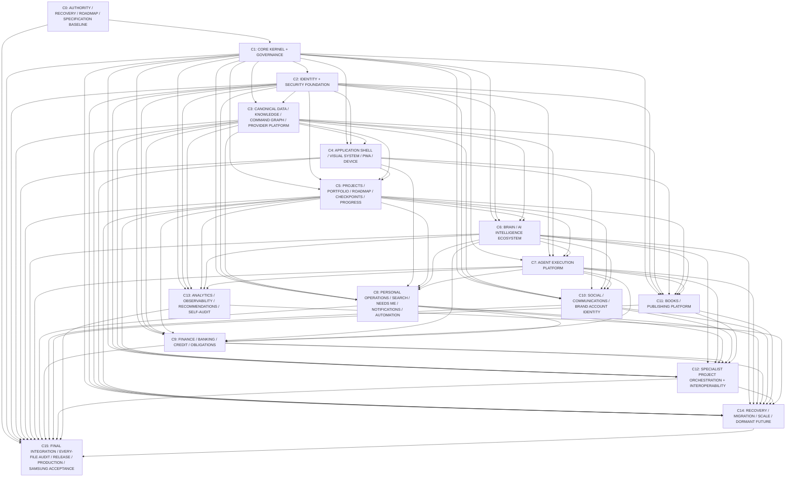

# COMMAND CENTER — CATEGORY DEPENDENCY GRAPH

```mermaid
flowchart TD
  C0["C0: AUTHORITY / RECOVERY / ROADMAP / SPECIFICATION BASELINE"]
  C1["C1: CORE KERNEL + GOVERNANCE"]
  C2["C2: IDENTITY + SECURITY FOUNDATION"]
  C3["C3: CANONICAL DATA / KNOWLEDGE / COMMAND GRAPH / PROVIDER PLATFORM"]
  C4["C4: APPLICATION SHELL / VISUAL SYSTEM / PWA / DEVICE"]
  C5["C5: PROJECTS / PORTFOLIO / ROADMAP / CHECKPOINTS / PROGRESS"]
  C6["C6: BRAIN / AI INTELLIGENCE ECOSYSTEM"]
  C7["C7: AGENT EXECUTION PLATFORM"]
  C8["C8: PERSONAL OPERATIONS / SEARCH / NEEDS ME / NOTIFICATIONS / AUTOMATION"]
  C9["C9: FINANCE / BANKING / CREDIT / OBLIGATIONS"]
  C10["C10: SOCIAL / COMMUNICATIONS / BRAND ACCOUNT IDENTITY"]
  C11["C11: BOOKS / PUBLISHING PLATFORM"]
  C12["C12: SPECIALIST PROJECT ORCHESTRATION + INTEROPERABILITY"]
  C13["C13: ANALYTICS / OBSERVABILITY / RECOMMENDATIONS / SELF-AUDIT"]
  C14["C14: RECOVERY / MIGRATION / SCALE / DORMANT FUTURE"]
  C15["C15: FINAL INTEGRATION / EVERY-FILE AUDIT / RELEASE / PRODUCTION / SAMSUNG ACCEPTANCE"]
  C0 --> C1
  C1 --> C2
  C1 --> C3
  C2 --> C3
  C1 --> C4
  C2 --> C4
  C3 --> C4
  C1 --> C5
  C2 --> C5
  C3 --> C5
  C4 --> C5
  C1 --> C6
  C2 --> C6
  C3 --> C6
  C5 --> C6
  C1 --> C7
  C2 --> C7
  C3 --> C7
  C5 --> C7
  C6 --> C7
  C1 --> C8
  C2 --> C8
  C3 --> C8
  C4 --> C8
  C5 --> C8
  C6 --> C8
  C7 --> C8
  C1 --> C9
  C2 --> C9
  C3 --> C9
  C5 --> C9
  C6 --> C9
  C7 --> C9
  C8 --> C9
  C1 --> C10
  C2 --> C10
  C3 --> C10
  C4 --> C10
  C5 --> C10
  C6 --> C10
  C7 --> C10
  C1 --> C11
  C2 --> C11
  C3 --> C11
  C4 --> C11
  C5 --> C11
  C6 --> C11
  C7 --> C11
  C1 --> C12
  C2 --> C12
  C3 --> C12
  C5 --> C12
  C6 --> C12
  C7 --> C12
  C8 --> C12
  C9 --> C12
  C10 --> C12
  C11 --> C12
  C1 --> C13
  C2 --> C13
  C3 --> C13
  C5 --> C13
  C6 --> C13
  C7 --> C13
  C1 --> C14
  C2 --> C14
  C3 --> C14
  C4 --> C14
  C5 --> C14
  C6 --> C14
  C7 --> C14
  C8 --> C14
  C9 --> C14
  C10 --> C14
  C11 --> C14
  C12 --> C14
  C13 --> C14
  C0 --> C15
  C1 --> C15
  C2 --> C15
  C3 --> C15
  C4 --> C15
  C5 --> C15
  C6 --> C15
  C7 --> C15
  C8 --> C15
  C9 --> C15
  C10 --> C15
  C11 --> C15
  C12 --> C15
  C13 --> C15
  C14 --> C15
```

Category 15 is the only category that contains production deployment and owner/Samsung acceptance.
